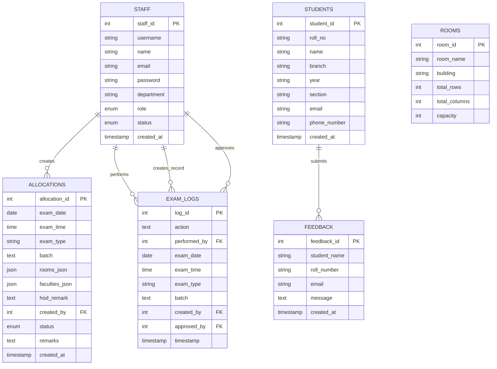

# ER Model & Database Diagrams

This document provides a visualization of the database structure and instructions on how to generate professional diagrams for project reports.

## 1. Visual ER Diagram (Mermaid)

The following diagram shows the entities and their primary/foreign key relationships based on the project's MySQL schema.

---

## 2. Steps to Generate Professional ER Diagrams

If you need high-resolution diagrams for your project documentation, follow these steps using common database tools:

### Option A: Using MySQL Workbench (Recommended)
1.  **Open MySQL Workbench** and connect to your local database instance.
2.  Go to the top menu: **Database > Reverse Engineer...** (or press `Ctrl+R`).
3.  Choose your stored connection and click **Next**.
4.  Execute the connection steps until you reach the **Select Schemas** page.
5.  Select `jntu_exam_management` and click **Next**.
6.  The wizard will import your tables. Click **Execute** and then **Finish**.
7.  A visual ER diagram will be automatically generated. You can drag tables to rearrange them and export the result via **File > Export > Export as PNG/PDF**.

### Option B: Using DBeaver (Open Source Tool)
1.  **Launch DBeaver** and connect to your database.
2.  Expand your database connection in the sidebar until you see the **Tables** folder.
3.  Right-click on the `jntu_exam_management` database or the **Tables** folder itself.
4.  Select **View Diagram** or double-click on the database and click the **ER Diagram** tab at the top.
5.  DBeaver will generate a high-quality visualization that you can export.

### Option C: Using Online Tools (dbdiagram.io)
1.  Open [dbdiagram.io](https://dbdiagram.io/).
2.  Copy your MySQL schema from `database/mysql_setup.sql`.
3.  Paste the SQL into the editor (select **Import > Import from MySQL**).
4.  The tool will render a professional-looking diagram instantly which you can share or download.

---

## 3. Relationship Explanations

- **Staff & Allocations**: Each allocation record is created by a specific staff member (`created_by`).
- **Staff & Exam Logs**: Multiple staff members are involved in logging actions (who performed it, who created the record, and who approved it).
- **Rooms & Students**: These are independent master tables but are logically linked within the `rooms_json` and `faculties_json` fields in the `allocations` table to store complex 2D seating matrices.
